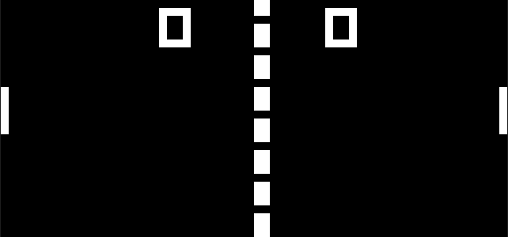

# CHIP-8 Emulator
A CHIP-8 emulator built in the Zig programming language.

## Requirements
Zig 0.12 or 0.13

## Setup
Clone including submodule: `git clone --recurse-submodules --shallow-submodules <repository-link>` 
From the root folder: Build and run: `zig build run -- <path/to/chip-8-program>`
